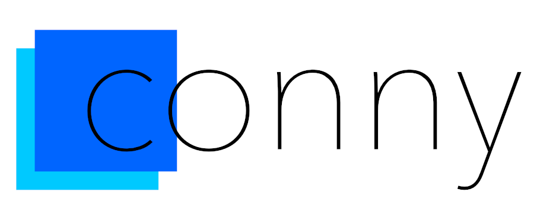

# conny

A simple dart console library

## Features
 - Colours
 - Graphics (bold, italic, etc)
 - Erase
 - Bars
 - Prompts (Not stable, and not documented. looking in lib folder/prompts.dart should explain usage)

## Getting Started
To get started with conny, look into the [example](https://github.com/Downmoto/conny/tree/main/example) dir in the repository

## Documentation

Read the [Documentation](https://github.com/Downmoto/conny/tree/main/docs)

## License

[MIT](https://choosealicense.com/licenses/mit/)

