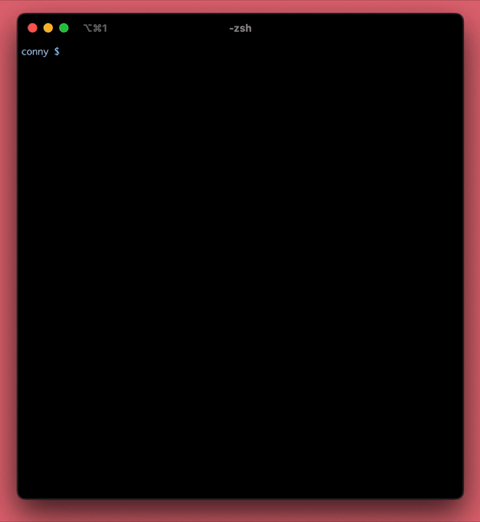
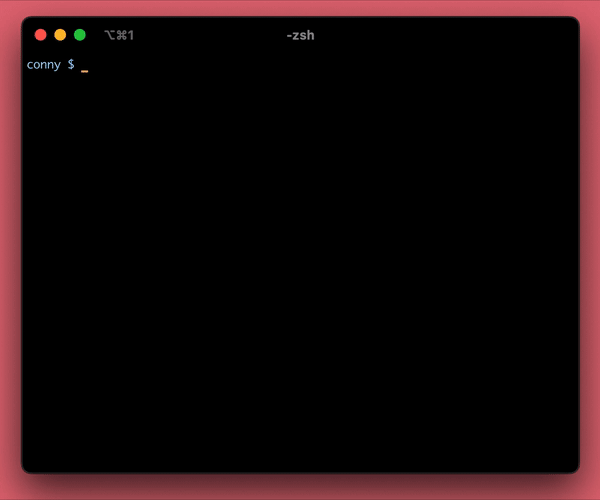

# conny Documentation 

## conny
[Documentation](https://github.com/Downmoto/conny/tree/main/docs/conny)

## curse
[Documentation](https://github.com/Downmoto/conny/tree/main/docs/curse)

## bars
[Documentation](https://github.com/Downmoto/conny/tree/main/docs/bars)

