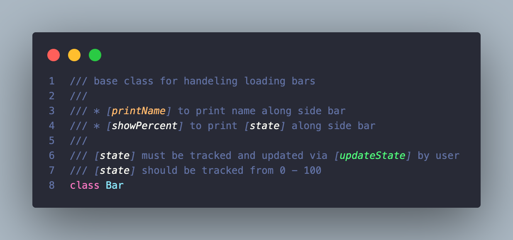

# bars.dart



## Usage 

```dart
import 'package:conny/conny.dart';
import 'dart:io';

void main(List<String> args) {
  Bar bar = Bar("loading bar", 30);

  int state = 0;
  for (String s in bar.start()) {
    stdout.write(s);
    bar.updateState(state += 10);
  }
}
```

## Fields

### name
```dart
Bar bar = Bar("loading bar", 30);
String name = bar.name
```
returns the Bar name set through constructor

### length
```dart
Bar bar = Bar("loading bar", 30);
int length = bar.length
```
returns the Bar length set through constructor

### state
```dart
Bar bar = Bar("loading bar", 30);
int barState = bar.state
```
returns the current state of the Bar object
state runs from 0 - 100, states < 0 or > 100 have undocumented behaviour

### showName
```dart
Bar bar = Bar("loading bar", 30);
bool showName = bar.showName;
```
defaults to false, set to true to display the Bar name to the left of the bar

### showPercent
```dart
Bar bar = Bar("loading bar", 30);
bool showPercent = bar.showPercent;
```
defaults to false, set to true to display the Bar percent/state to the right of the bar

### light, dark
```dart
Bar bar = Bar("loading bar", 30);
int bar.light = 0x2591;
int bar.dark = 0x2593;
```
light refers to the 'unloaded' segment of the bar and dark refers to the 'loaded' part of the bar, they are public field and can be changed freely. they are rendered through String.fromCharCode

## Constructor
```dart
Bar bar = Bar("loading bar", 30);
```
initialises name and bar length

## Methods

### updateState(int state)
```dart
// should be called in the for in loop
Bar bar = Bar("loading bar", 30);
int state = 0;
for (String s in bar.start()) {
    stdout.write(s);
    bar.updateState(state += 10);
}
```
updates state at whatever interval your loop deems appropriate
state should run through 0 - 100

### start()
```dart
// should be called in the for in loop
Bar bar = Bar("loading bar", 30);
int state = 0;
for (String s in bar.start()) {}
```
entry point for generator, yields the updated bar.
this will continue yielding String objects until the state is >= 100