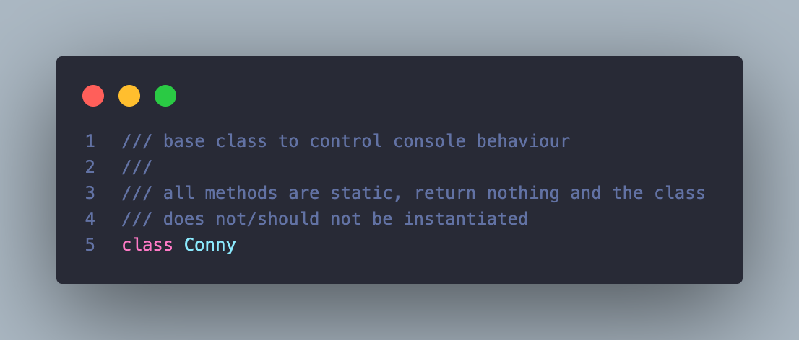

# conny.dart



## Usage

```dart
import 'package:conny/conny.dart';

void main(List<String> args) {
  WriteOptions opt = WriteOptions(
    bold: true,
    fg: [180, 240, 55],
    bg: [90, 120, 190]
  );

  String str = "Hello, World!";

  Conny.write(opt, str);
}
```

## Conny
base class to control console behaviour

all methods are static, return nothing and the class
does not/should not be instantiated

## Fields
There are no public fields in the Conny class

## Constructor
There is no constructor for the Conny class, the class should not be instantiated as all methods are static

## Methods

### write(WriteOptions options, String str, {bool newline = true})
```dart
WriteOptions opt = WriteOptions(
    bold: true,
    fg: [180, 240, 55],
    bg: [90, 120, 190]
);

String str = "Hello, World!";

Conny.write(opt, str);
```
writes to [stdout] with options provided then resets to default.
throws [NoTerminalException] if no terminal is attached

[WriteOptions] have default values and are intended to be set by user

[str] is a [String] object which will be written to [stdout]

[newline] is an optional argument defaulted to true

### style(WriteOptions options, String str)
```dart
WriteOptions opt = WriteOptions(
    bold: true,
    fg: [180, 240, 55],
    bg: [90, 120, 190]
);

String s = Conny.style(opt, "Hello, World!");

stdout.write(s);
```
inline styling to create strings with graphic and colour options, 
using [WriteOptions], without writing to [stdout]

throws [NoTerminalException] if no terminal is found

throws [OutOfRangeException] if RGB range requirments are not met (0 - 255)

returns styled [String], ready to write

### reset()
```dart
Conny.setGraphic(bold: true);
stdout.write("Hello, World!");

Conny.reset();
```
reset all set graphic and colour modes to terminal default

throws [NoTerminalException] if no terminal is attached

### setGraphic({bool bold = false, bool dim = false, bool italic = false, bool underline = false, bool strike = false})
```dart
Conny.setGraphic(bold: true);
stdout.write("Hello, World!");
Conny.reset();
```
set graphic modes, use [unsetGraphic] or [reset] to revert graphics

throws [NoTerminalException] if no terminal is attached

### unsetGraphic({bool bold = false, bool dim = false, bool italic = false, bool underline = false, bool strike = false})
```dart
Conny.setGraphic(bold: true);
stdout.write("Hello, World!");
Conny.unsetGraphic(bold: true);
```
unset speific graphic modes, use [reset] to unset all

throws [NoTerminalException] if no terminal is attached

### setColour(Colour fg)
```dart
Conny.setColour(Colour.RED);
stdout.write("Hello, World!");
Conny.reset();
```
set foreground[fg] colours using [Colour] Enum

throws [NoTerminalException] if no terminal is attached

### setColour256(int idfg)
```dart
Conny.setColour256(230);
stdout.write("Hello, World!");
Conny.reset();
```
set colours using an id in range of 0 - 255

0 - 15 are the Enum Colours + bright variants

16 - 231 are different colour variants,

232 - 255 are grayscale starting with a lighter black

throws [OutOfRangeException] if [idfg] is > 0 || < 256

throws [NoTerminalException] if no terminal is attached

[idfg] foreground ID

### setColourRGB(List fg)
```dart
Conny.setColourRGB([130, 150, 70]);
stdout.write("Hello, World!");
Conny.reset();
```
set colours using RGB values

params should mimic this variable:
var varName = [0, 0, 0]

throws [OutOfRangeException] if [fg] does not contain 3 integer values
or if any of the values are > 0 || < 256

throws [NoTerminalException] if no terminal is attached

### setBackgroundColour(Colour clr)
```dart
Conny.setBackgroundColour(Colour.RED);
stdout.write("Hello, World!");
Conny.reset();
```
set background [clr] colour using [Colour] Enum

throws [NoTerminalException] if no terminal is attached

### setBackgroudColour256(int idclr)
```dart
Conny.setBackgroundColour256(230);
stdout.write("Hello, World!");
Conny.reset();
```
set colour using an [int] id in range of 0 - 255

0 - 15 are the Enum Colours + bright variants

16 - 231 are different colour variants,

232 - 255 are grayscale starting with a lighter black

throws [OutOfRangeException] if [idclr] is > 0 || < 256

throws [NoTerminalException] if no terminal is attached

[idclr] background ID

### setBackgroundColour(List clr)
```dart
Conny.setBackgroundColourRGB([130, 150, 70]);
stdout.write("Hello, World!");
Conny.reset();
```
set colour using RGB values

params should mimic this variable:
List<int> varName = [0, 0, 0]

throws [OutOfRangeException] if [clr] does not contain 3 integer values or if any of the values are > 0 || < 256

throws [NoTerminalException] if no terminal is attached

### erase({bool screen = false})
```dart
Conny.erase(screen: true);
```
erase line or screen, this does not reposition cursor

throws [NoTerminalException] if no terminal is attached

[screen] is defauled to false, thus by default [erase] erases the line the cursor is on

## WriteOptions
holds options for [Conny.write] and [Conny.style]

## Fields
There are no public ields in the WriteOptions class

## Constructor
```dart
WriteOptions({
    bool bold = false,
    bool dim = false,
    bool italic = false,
    bool underline = false,
    bool strike = false,
    List<int> fg = [-1, -1, -1],
    List<int> bg = [-1, -1, -1]
})
```
WriteOptions are used by the Conny write and style static methods
all options are optianlly set

## Methods

### options()
```dart
WriteOptions opt = WriteOptions(
    bold: true,
    fg: [180, 240, 55],
    bg: [90, 120, 190]
);

Map<String, dynamic> o = opt.options()
```
returns [Map] object of type [String] and [dynamic] with set user write options
this method is used internally by the conny class
