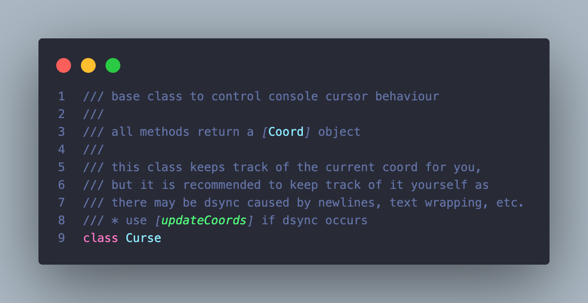

# Content
- [curse.dart](#cursedart)
  * [Usage](#usage)
  * [Curse](#curse)
    * [Fields](#fields)
        + [coord](#coord)
    * [Constructor](#constructor)
    * [Methods](#methods)
        + [home()](#home)
        + [moveTo()](#movetoint-col-int-col)
        + [moveToCoord()](#movetocoordcoord-coord)
        + [moveToColumn()](#movetocolumnint-col)
        + [moveCursorDir()](#movecursordirint-by1)
  * [Coord](#coord)
    * [Fields](#fields-1)
        + [col](#col)
        + [row](#row)
    * [Constructor](#constructor-1)
    * [Methods](#methods-1)

# curse.dart



## Usage
```dart
import 'package:conny/conny.dart';

void main(List<String> args) {
  Curse c = Curse();

  c.moveToCoord(Coord(10, 10));
}
```

## Curse

## Fields

### coord
```dart
Curse c = Curse();
Coord coords = c.coord
```
returns the internal Coord object

## Constructor
```dart
Curse c = Curse();
```
checks state of terminal and initialises internal coord field

## Methods

### home()
```dart
Curse c = Curse();
c.home(); // if you dont require return value
Coord crd = c.home(); // if you want the return value
```
move cursor to (0,0)/(1,1) depending on terminal behaviour

sets and returns [Coord] object

### moveTo(int col, int col)
```dart
Curse c = Curse();
c.moveTo(10, 10); // if you dont require return value
Coord crd = c.moveTo(10, 10); // if you want the return value
```
move cursor to [col], [row] 

throws [CursorOutOfRangeException] if [coloumn] is less
than or equal to [stdout.terminalColumns]

sets and returns [Coord] object

### moveToCoord(Coord coord)
```dart
Curse c = Curse();
c.moveToCoord(Coord(10, 10)); // if you dont require return value
Coord crd = c.moveToCoord(Coord(10, 10); // if you want the return value
```
identical to moveTo but takes a [Coord] object as its sole arg

throws [CursorOutOfRangeException] if [coloumn] is less
than or equal to [stdout.terminalColumns]

sets and returns [Coord] object

### moveToColumn(int col)
```dart
Curse c = Curse();
c.moveToColumn(10); // if you dont require return value
Coord crd = c.moveToColumn(10); // if you want the return value
```
move cursor to [column]

throws [CursorOutOfRangeException] if [coloumn] is less
than or equal to [stdout.terminalColumns]

sets and returns [Coord] object

### moveCursor[dir]({int by=1})
```dart
Curse c = Curse();
c.moveCursorDown(by: 5); // if you dont require return value
Coord crd = c.moveCursorRight(by: 15); // if you want the return value
```
moves cursor up, down, left, right [by]

sets and returns [Coord] object

## Coord

## Fields

### col
```dart
Coord crd = Coord(10, 15);
int col = crd.col; // 10
```
public field

### row
```dart
Coord crd = Coord(10, 15);
int row = crd.row; // 15
```
public field

## Constructor
```dart
Coord crd = Coord(10, 15);
```
initializes col and row fields

## Methods
There are no methods in the Coord class